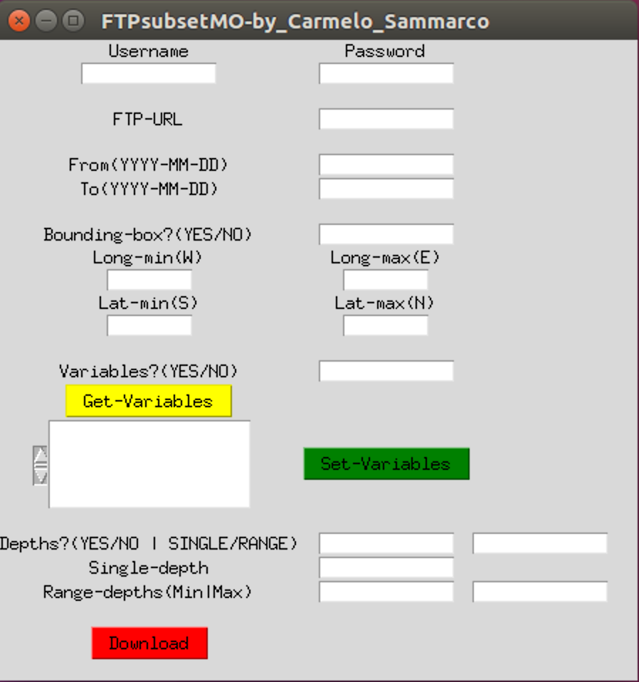

# FTPsubsetMO - FTP subsetting service 

[](https://travis-ci.com/carmelosammarco/FTPsubsetMO) [](https://ci.appveyor.com/project/carmelosammarco/FTPsubsetMO) 

**I developed this software because motivated to improve my efficiency and productivity. It is just an attemp/idea/prototype and it is not fully optimased or considered stable.**

Many thanks to visit this page and try this software.

**Carmelo Sammarco**


## Be aware that:

The tool is in development so it can be possible find bugs, errors and imprecisions. Please to report them if you find one.

In the Database just the MY datasets are avaiable (still missing NRT datasets).

For more detailed information about the MULTI YEAR datasets please to look the [MY_datasets](FTPsubsetMO/Database/datasets_MY.pdf) file.

## Introduction:

Python software able to download files over FTP protocol and subset the files retrieved by parameters as time-range, bounding box, variables and single/range Depth levels (below the GUI interface displayed on a Linux system).

<p align="center">
   
</p>

Together with this tool is distribuited a database which store all the information needed to download the files from each datasets (type of data-set (NRT/MY), time steps (DAILY/MONTLY) and other two parameters needed to correctly identify and select the files prior the download. The key value to retrive such information is the FTP URL of the targeted dataset. It was ideated and implemented by me to adress the download automatization. However I really push the Producers to uniform all the data_structure/file_names and Metadata info (which will make easier the database creation/updates).

After the download which uses the python module "ftplib" (The files are downloaded in the same directory where the tool run) all the subsequent analyses are mainly performed with xarray (another python module). Below the full list of dependencies required (They are installed automatically during the installation if not avaiable in the python environment used):

- [x] xarray
- [x] ftputil>=3.4
- [x] netCDF4
- [x] pandas
- [x] datetime
- [x] os
- [x] json
- [x] hdf5
- [x] h5py
- [x] h5netcdf

## What the user needs to input?

1. **CMEMS personal login credential**

- CMEMS Username
- CMEMS Password

2. **FTP Link of the dataset** (Our key value to extract from the data-base all the parameters needed to make the Tool works) as example below:

```
/Core/BLKSEA_REANALYSIS_PHYS_007_004/sv04-bs-cmcc-cur-rean-m/
```

3. **Time range**

- Date start
- Date end

Date format as YYYY-MM-DD also in the case of the MONTHLY dataset where the term "DD" can be set to any real value.


4. **Geographic bounding box** (if interested to subset by geographic area)

5. **Variables name** (It is possible to select the variables from a list using the "Get-Variables" button, to register the selection just click on "Set-Variables)

6. **Depths** information parameter values (if interested in a SINGLE/RANGE  or all the depths)


# Additional information:

## Database changes:

Record example from [Master-branch](https://github.com/carmelosammarco/FTPsubsetMO):

```
"/Core/BLKSEA_REANALYSIS_PHYS_007_004/sv04-bs-cmcc-cur-rean-m/" : ["MY","M","FRONT","01_m-CMCC--RFVL-BSe2r2-BS-b"],
```

Record example from this current branch:

```
"/Core/BLKSEA_REANALYSIS_PHYS_007_004/sv04-bs-cmcc-cur-rean-m/" : ["MY","M","FRONT","01_m-CMCC--RFVL-BSe2r2-BS-b",”1992-01-01”,”2018-11-01”, ”27.32”, “41.96”, “40.86”, “46.8”, “LDY”, “Variable1”, “Variable2”… ]
 ```

These modification will adress easily the check/Actions for:

- Bounding box limits (W-E-S-N)
- Variables selection
- Level Depths (LDY/LDN)
- Date range validation

## Code improvements to be done:

- Follow the [PEP 8 style guide](https://www.python.org/dev/peps/pep-0008/)

- More Verbosity to guide better the user

## Different scenario to consider for warning/actions to show/take:


1) **Before the download:**

- About Bounding box limits

- About Date format

- About level of Depths (If present or not)


2) **During download:**

- Connection interrupted

- No file available


3) **After the download:**

- Verify metadata homogeneity

- Can be improved better after many tests and user feedbacks


## Python module/script installation:

Just type in the terminal/command-prompt:

```
pip install FTPsubsetMOVS (if present pypi repository)
```

or download the folder and using the terminal/command_prompt go inside the folder and type:

```
pip install ./
```

After that you are free to decide if you want to use the GUI interface or exexute it as script. The latter will allow the maximum customization but as cons it is not very user friendly. 

-----

**To use the GUI interface**  just type on terminal/command-prompt:

```
FTPsubsetMO
```

After that just type on the pop upped screen the parameters asked/required. Finally just click on the red download button to start the download/subsetting process.

-----

**To use the program as a script** and then be able to be free in look/modify/customise the code please to:

1. Open the Terminal/command_prompt in the location where you desire download the files or anyway have the script

2. Activate your python environment and import the module:

```
from FTPsubsetMO import script
```
3. Run the function "script" as follow: 

```
script()
```

The above function will allow you to add, in the path folder where you run the command, the files needed (which are CMEMS_Database.json and FTPsubsetMO.py) to run the subsetting process in a pure scripting way. "FTPsubsetMO.py" is the only file to modify based on your data request needs. The script's inputs are highlighted with **""**. More information can be found as form of comments in FTPsubsetMO.py script.
